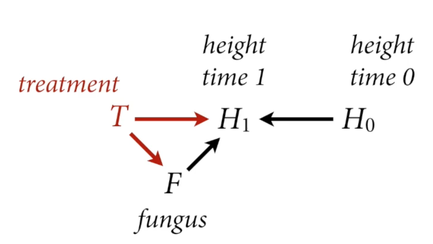

# Lecture 5: Elemental Confounds

```{r}
#| output: false
# load data and copy
library(rethinking)
data("WaffleDivorce")
d <- WaffleDivorce
```

Correlation is common in nature, causation is sparse

Estimand: Ideal Cake

Estimator: Recipe

Estimate: Reality Cake

Statistical recipes must defend *against* confounding

+--------------------+------------+--------------------------+---+--------------------------------------------+
|                    |            | Are X and Y independent? |   | Is there association after stratification? |
+====================+============+==========================+===+============================================+
| **The Fork**       | X ← Z → Y  |                          |   |                                            |
+--------------------+------------+--------------------------+---+--------------------------------------------+
| **The Pipe**       | X → Z → Y  |                          |   |                                            |
+--------------------+------------+--------------------------+---+--------------------------------------------+
| **The Collider**   | X → Z ← Y  |                          |   |                                            |
+--------------------+------------+--------------------------+---+--------------------------------------------+
| **The Descendant** | X → Z → Y\ |                          |   |                                            |
|                    | \|         |                          |   |                                            |
|                    |            |                          |   |                                            |
|                    | A          |                          |   |                                            |
+--------------------+------------+--------------------------+---+--------------------------------------------+

## The Fork

$$
X \leftarrow Z \rightarrow Y
$$

-   X and Y are associated (Y is not independent of X)

-   Share a common cause Z

-   Once stratified by Z, no association $Y \mathrel{\unicode{x2AEB}} X|Z$

```{r}
# simple simulation with discrete data (0s,1s)
n <- 1000
Z <- rbern(n, 0.5)
X <- rbern(n, (1-Z)*0.1 + Z*0.9)
Y <- rbern(n, (1-Z)*0.1 + Z*0.9)

table(X,Y)
cor(X,Y)

table(X,Y,Z)
cor(X[Z==0],Y[Z==0])
cor(X[Z==1], Y[Z==1])
```

```{r}
# simulation with continuous data, showing the fork confound 
cols <- c(4,2)

N <- 300
Z <- rbern(N) 
X <- rnorm(N, 2*Z-1) # Z=1 will be positive, Z=0 will be negative
Y <- rnorm(N, 2*Z - 1)

plot(X,Y, col=cols[Z+1], lwd=3)

abline(lm(Y[Z==1]~X[Z==1]), col=2,lwd=3) # red when Z == 1
abline(lm(Y[Z==0] ~ X[Z==0]), col=4, lwd=3) # blue when Z == 0

abline(lm(Y~X), lwd=3) # Regression line for total sample, ignoring Z
# Stratefying by common cause
```

Fork Example

-   Why do regions of the USA with higher rates of marriage also have higher divorce rates?

    M → D ?

Another variable: age at marriage

```{r}
library(dagitty)
ldag5.1 <- dagitty("dag{
                   A -> D
                   A -> M
                   M -> D }")
coordinates(ldag5.1) <- list(x=c(M=0, A=1, D=2), y=c(D=0,A=1, M=0))
drawdag(ldag5.1)

```

**Estimand**: Causal effect of **marriage** rate on **divorce** rate

Fork: M ← A → D

-   To estimate causal effect of M, need to break the fork. **By stratifying by A**

What does it mean to stratify by a continuous variable?

-   It depends

-   How does A influence D? What is $D=f(A,M)$?

-   In linear regression:

$$D_i \sim {\sf Normal}(µ_i, \sigma)$$

$$
µ_i=\alpha + \beta_mM_i + \beta_aA_i
$$

-   Every value of A produces a different relationship between D and M

    $µ_i= (a + \beta_AA_i) + \beta_MM_i$

    -   Where $a + \beta_AA_i$ is the intercept

Statistical Fork

-   To stratify by A (age at marriage), include as term in linear model

-   We are going to standardize the variables (convenient in linear regression)

    -   **standardize**: make the mean 0 and divide by the SD

    -   Computation works better

    -   Easy to choose sensible priors

Prior Predictive Simulation

```{r}
n <- 20 
a <- rnorm(n,0,0.2)
bM <- rnorm(n, 0, 0.5)
bA <- rnorm(n, 0, 0.5)

plot(NULL, xlim=c(-2,2), ylim=c(-2,2),xlab="Median age of marriage (std)", ylab="Divorce rate (std)")

Aseq <- seq(-3.3, len=30)
for (i in 1:n) {
  mu <- a[i] + bA[i] * Aseq
}

for (i in 1:n) {
  mu <- a[i] + bA[i] * Aseq
  lines(Aseq, mu, lwd=2, col=2)
}
```

Analyze Data

```{r}
# create data list with standardized vals 
dat <- list(
  D = standardize(d$Divorce),
  M = standardize(d$Marriage),
  A = standardize(d$MedianAgeMarriage)
)

m_DMA <- quap(
  alist(
    D ~ dnorm(mu, sigma),
    mu <- a + bA * A + bM * M,
    a ~ dnorm(0,0.2),
    bM ~ dnorm(0,0.5),
    bA ~ dnorm(0,0.5),
    sigma ~ dexp(1)
  ), data=dat
)
plot(precis(m_DMA))
```

`plot(precis(model_name))` Caterpillar Plot - good for visualizing summary of model with standardized variables

-   What's the causal effect of M?

    -   Just because the interval of M var *includes zero* does not mean that the causal effect of M is zero!

    -   People will often report the slope of M as the causal effect of M, which is not terrible, but it's not actually right. In a perfectly linear model. But nonlinear models complicate things.

-   bA is quite negative, though same level of uncertainty in both slopes (bA and bM)

[**Simulating Interventions**]{.underline}

-   Causal effect is a manipulation of the generative model, an **intervention**

-   $p(D|do(M)$ means the distribution of D when we intervene ("do") M

-   This implies deleting all arrows into M and simulating D

```{r}
ldag5.2 <- dagitty("dag{
                   A -> D
                  
                   M -> D }")
coordinates(ldag5.2) <- list(x=c(M=0, A=1, D=2), y=c(D=0,A=1, M=0))
drawdag(ldag5.2)
```

```{r}
# Extract samples from the model 
post <- extract.samples(m_DMA)

# Sample A from the data, the empirically observed median age of marriage vals with Replacement 
# 1000 states 
n <- 1e3
As <- sample(dat$A, size=n, replace=TRUE)

# Simulate D for M=0 (sample mean)
DM0 <- with(post, # with makes it so we don't have to use $ to access columns 
            rnorm(n, a + bM*0 + bA*As, sigma))

# Simulate D for M=1 (+1 SD), use the *same* A values 
DM1 <- with(post, 
            rnorm(n, a + bM*1 + bA * As, sigma))

# Compute the constrast 
M10_contrast <- DM1 - DM0 
dens(M10_contrast, lwd=4, col=2, xlab="effect of 1SD increase in M")
```

-   Posterior distribution of the causal effect of intervening on M to inc it by one standard deviation on divorce rate. Centered on Zero, but could be big or small → can't say that there's no effect (variability on population error)

    -   But certainly it's a much smaller effect that the causal effect of A on D

    -   Need to run another model

Causal effect of A?

-   How to estimate causal effect of A, $p(D|do(A))$

    -   No arrows to delete for intervention

    -   Fit new model that ignores M, then simulate any intervention you like

-   Why does ignoring M work?

    -   Because A → M → D is a "pipe" (remember from last lecture with the Howell weight, age, height data)

## The Pipe

-   X and Y are associated (Y is not independent of X)

-   The influence of X on Y transmitted through Z

-   Once stratified by Z, no association $Y \mathrel{\unicode{x2AEB}} X|Z$

$$
X \rightarrow Z \rightarrow Y
$$

```{r}
n <- 1e3
X <- rbern(n, 0.5)
Z <- rbern(n, (1-X)*0.1 + X*0.9)
Y <- rbern(n, (1-Z)*0.1 + Z*0.9)

table(X,Y)
cor(X, Y)

table(X[Z==0], Y[Z==0])
cor(X[Z==0], Y[Z==0])

table(X[Z==1], Y[Z==1])
cor(X[Z==1], Y[Z==1])
```

Everything that Y knows about X, is known by Z. Once you learn Z, there's nothing more to learn about the association between X and Y (because all the assoication info passes thru Z).

```{r}
cols <- c(4,2)

N <- 300 
X <- rnorm(N) # continuous
Z <- rbern(N, inv_logit(X)) # discrete Z 
Y <- rnorm(N, 2*Z-1) # continuous 

plot(X, Y, col=cols[Z+1], lwd=1)
abline(lm(Y[Z==1] ~ X[Z==1]), col=2, lwd=3)
abline(lm(Y[Z==0] ~ X[Z==0]), col=4, lwd=3)

abline(lm(Y ~ Z),lwd=3)
```

Pipe example

-   plants growth experiment

-   100 plants

-   half treated with anti-fungal

-   measure growth and fungus

-   Estimand: Causal effect of treatment on plant growth

**Scientific Model**

F → H1 (height time 1) ← H0 (height time 0)

{width="418"}

**Statistical Model**

-   [Estimand]{.underline}: Total causal effect of T

-   The path $T \rightarrow F \rightarrow H_1$ is a pipe

-   Should we stratify by F?

    -   NO, that would block the pipe

    -   The treatment flow

**Post-treatment bias**: Consequences of treatment should not usually be included in the estimator

## The Collider

$$
X \rightarrow Z \leftarrow Y
$$

-   X and Y are not associated (don't share causes, independent of each other)

-   X and Y both influence Z

-   Once stratified by Z, X and Y are associated

```{r}
# Discrete simmulation 
n <- 1000
X <- rbern(n, 0.5)
Y <- rbern(n, 0.5)
Z <- rbern(n, ifelse(X+Y>0, 0.9, 0.2)) 
        # Z = 1 90% of time when X+Y is greater than 0; but when X+Y<0, Z=1 20% of the time 

table(X,Y)
cor(X,Y) # No correlation

table(X[Z==0], Y[Z==0])
cor(X[Z==0], Y[Z==0])

table(X[Z==1], Y[Z==1])
cor(X[Z==1], Y[Z==1])
```

```{r}
# continuous simulation 
cols <- c(4,2)

N <- 300 
X <- rnorm(N) # continuous
Y <- rnorm(N) # continuous 
Z <- rbern(N, inv_logit(2*X+2*Y-2)) # discrete Z 

plot(X, Y, col=cols[Z+1], lwd=1)
abline(lm(Y[Z==1] ~ X[Z==1]), col=2, lwd=3)
abline(lm(Y[Z==0] ~ X[Z==0]), col=4, lwd=3)

abline(lm(Y ~ X),lwd=3)
```

[**Collider Examples**]{.underline}

**Some biases arise from selection** (data collection)

-   Suppose: 200 grant applications

    -   Each scored on newsworthiness and trustworthiness

    -   No association in population

    -   Strong association after selection:

        -   negative association in the *funded grants* between trustworthiness and newsworthiness: the most newsworthiness have below average rigor in this applicant pool

        -   But not a feature of how grants are written, but a **feature of selection** (once you stratify by whether it was funded or not)

$$
N \rightarrow A \leftarrow T
$$

-   Awarded grants must have been sufficiently newsworthy and trustworthy. Few grants are high in both. Results in a **negative association**, conditioning on award

-   Similar examples:

    -   restaurants survive by having good food or a good location =\> bad food in good locations

        -   Restaurants must survive by either one of two ways: have good food, or good location. (can be both, but pretty rare)

        -   Induce slight conditioning on collider (nothing about being in a bad neighborhood that makes the food good)

    -   Actors can succeed by being attractive or by being skilled =\> attractive actors are less skilled (selection bias of seeing only those actors that succeed, being attractive is not causally related to being bad at acting).

**Endogenous Colliders**

-   Collider bias can arise thru statistical processing (e.g., how you define the estimator)

-   **Endogenous selection**: if you condition on (stratify by) a collider, creates phantom non-causal associations

-   Example: Does age influence happiness?

Age and Happiness

-   Estimand: Influence of age on happiness

-   Possible confound: Marital status

-   Suppose age has zero influence on happiness

-   But both age and happiness influence marital status (happier people more likely to be married, older you are, the more chances of marriage)

$$
H \rightarrow M \leftarrow A
$$

-   Stratified by marital status, negative association between age and happiness

    -   If you included marital status in your estimator *as a control,* it would in fact induce a confound: a negative association between age and happiness (just not true)

## The Descendant

How a descendant behaves depends upon what it is attached to

-   Z and Y are causally associated thru Z

-   A (descendant) holds info about Z

-   If we stratify by A, X and Y are less associated

```{r}
n <- 1000
X <- rbern(n, 0.5)
Z <- rbern(n, (1-X)*0.1 + X*0.9)
Y <- rbern(n, (1-Z)*0.1 + Z*0.9)
A <- rbern(n, (1-Z)*0.1 + Z*0.9)

table(X,Y)
cor(X,Y)

table(X[A==0], Y[A==0])
cor(X[A==0], Y[A==0])

table(X[A==1], Y[A==1])
cor(X[A==1], Y[A==1])
```

-   Same as pipeline, X influences Z and Z influence Y. But A doesn't influence anything.

-   Then, we stratify by A while ignoring Z, we end up messing up the experiment → you get the wrong estimate

Descendants are Everywhere

-   Many measurements are **proxies** of what we wish we could measure

-   Factor analysis

-   Measurement error

-   Social networks
